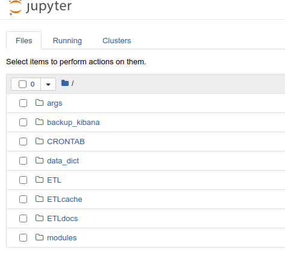

# Specific Documentation for ETLs

All logs generated by automated ETL are visible from **Jupyter's container root**.

### CRONTAB config
Automated ETL work through CRONTAB file **inside** Jupyter's container. Steps for configuration:

1. If Jupyter container is running: `docker-compose stop jupyter`.
2. Add entries to [CRONTAB file](../CRONTAB/crontab.sh)
3. `docker-compose up jupyter`

### Execute ETL in standalone mode with parameters

1. Use corresponding [.yaml file in "args"](../args).
2. Add entry to [Custom ETL Linux script](../ETL/ETL_custom.sh).
3. `docker-compose exec jupyter bash`.
4. En terminal dentro del contenedor Jupyter: `./ETL_custom.sh`.
5. Once executed the ETL, `exit`.

### Logs

[Folder with ETL Logs (Jupyter Notebooks)](../CRONTAB/logs) , "CRONTAB/logs"  in Jupyter's container root.

[CRONTAB Log](../CRONTAB/logs/cron.log.example) "CRONTAB/logs/cron.log" in Jupyter's container root.

### ETL Cache

* Aditionally, it is recommended to store intermediate ETL steps (such as .xlsx or .csv files) [in the corresponding mounted volume](../ETL/ETLdocs).
* [ETL Cache cleaning script:](../ETL/cleanETL.ipynb) ETL for mantaining a constant size of ETLcache (default 200 MB), keeping the last N files which acummulated size is below the threshold. Edit this ETL for changing the treshold, and activate it in the [CRONTAB sheduler](../CRONTAB/crontab.sh).
