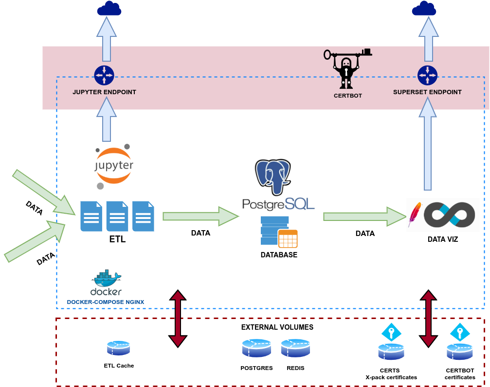

# SuperJupyter  
## Business Intelligence Stack with Airbnb Apache Superset and Jupyter Notebooks

Business Intelligence stack, based on **Apache Superset-PostGres** for **data warehousing** and **visualization**, and **Jupyter Notebooks** for development of automated **ETL** (Extract, Transform, Load) routines.

### Components:
 - **Apache Superset**: Airbnb Business Intelligence tool. Docker image based on amancevice docker-superset project:
    * https://hub.docker.com/r/amancevice/superset/
    * https://github.com/amancevice/docker-superset 
 - **PostgreSql**: Default Database for storing Superset metadata and other data (other connections to other databases can be added.) Based on amancevice docker-superset postgres example:
    * https://github.com/amancevice/docker-superset/tree/main/examples/postgres
 - **Jupyter Notebook**: Jupyter Container, derived from [Project Jupyter's Base Docker Image](https://jupyter-docker-stacks.readthedocs.io/en/latest/using/selecting.html), supercharged with [Supercronic](https://github.com/aptible/supercronic) and [Papermill](https://papermill.readthedocs.io/en/latest/) for enabling the automatic scheduling of python 3 ETL scripts.
 - **Nginx:** Nginx service built from [Nginx official Docker image](https://hub.docker.com/_/nginx). Used for enabling **https** on Kibana and Jupyter endpoints, and Elasticsearch REST API.
 - **Certbot:** Custom docker container for configuration of **https** SSL certificates, and automating its renewal. Based on [nginx-certbot project](https://github.com/wmnnd/nginx-certbot)

### Dependencies
 - Docker and Docker-compose.
 - node.js
 - npm
 - elastic dump [see install instructions](https://www.npmjs.com/package/elasticdump) 

## Setup 
 1. Create `.env` file and populate environment variables.Follow structure outlined in the [example .env file](example.env)
 2. `./bi-init.sh`--->Create the folders and change permissions necessary for **SuperJupyter** startup.
 3. Register 2 domains, for the Jupyter and Superset endpoints,all pointing to your **server/VM IP**.
 4. Change accordingly the environment variables on the `.env` file.
 5. `./certbot.sh`--->Create the SSL certificates and keystores for enabling **https** on the Kibana and Jupyter endpoints, and the Elasticsearch REST API.
 6. `docker-compose up`--->Start the stack
 7. Set up admin user.`docker-compose exec superset bash`, then:
    * `export FLASK_APP=superset`
    * `superset fab create-admin`---> Create an `admin` user and its password.
    * `superset db upgrade`
8. Optional:
    * `superset load_examples`----> Load sample data.
    * `superset init` ------>Not necessary (execute for restarting superset if desired)

## Startup
 1. `docker-compose up`--->Start the stack
 2. `docker-compose up docker-compose_local.yaml`---->Start the stack in local mode (without nginx nor certbot, for testing in local environment).
 3. `docker-compose up --build`--->Start the stack recreating the services after changes in environment variables.

## ETL DOCS
See [specific documentation](/ETLdocs/readme.md)

## File Structure
Root of **Jupyter Notebook** endpoint (served by **Jupyter** container):


#### Relevant File structure
```
📦EJK
┣ 📂CRONTAB
┃ ┣ 📂logs
┃ ┃Logs folder, where crontab status and output of Jupyter ETL scripts are stored.
┃ ┗ 📜crontab.sh
┃   Crontab script, which runs on Jupyter container at startup. Edit for configuration of ETL scheduling.
┣ 📂args
┃ Folder for python arguments (for being used by Jupyter Notebook container)
┣ 📂superset
┃ ┃ Superset config. files.
┃ ┗ 📜superset_config.py
┃   Superset config. file, which will be read by the container at startup.
┣ 📂ETL
┃  ETL scripts (jupyter notebooks)
┣ 📂jupyter
┃   Jupyter configuration files, including Dockerfile.
┣ 📂modules
┃  Custom python modules and classes.
┣ 📂nginx
┃  Nginx configuration files, including Dockerfile.
┃ ┣ 📂conf
┃ ┃ ┣ 📜nginx-docker-entrypoint.sh
┃ ┃ ┃   Script executed at nginx container startup. It substitutes parameters from .env file in virtual server configuration file.
┃ ┃ ┗ 📜nginx.conf.template
┃     Virtual server configuration file.
┣ 📜bi-init.sh
┃   Stack setup script.
┣ 📜certbot.sh
┃    Certbot setup script.
┣ 📜docker-compose.yml
┃    Stack docker-compose file.
┣ 📜.env
┃    .env file for EJK stack docker-compose file.
```
## TROUBLESHOOTING:
* **Jupyter Notebooks**:
   - `Permission denied: <filename>` when creating files or folders on Jupyter Notebook endpoint:
      * **Cause**: Permission problems with mounted volumes. Jupyter container has by default a "jovyan" user, which Linux id is 1000. The container will only recognize as "writable" files and folders that in **the host** belong to the same Linux id==1000 (independent of the name of user and group).
      * **Diagnostic**:
         1. `docker-compose exec jupyter bash`.
         2. `id`------>This will list the jovyan user properties, including its Linux ID.
         3. `cd` into any of the mounted folders, then `ls -all`, check the folders and files owners and groups, if they do not belong to UID==1000, then there will be trouble.
         4. `exit` and `cd` into any of the mounted folders in the **host**, check who really owns the folders or files.
      * **Solution**, either:
         - **Copy permissions from a folder that works**
            * `sudo chmod -R --reference=<source_folder> <target_folder>`
            * `sudo chown -R --reference=<source_folder> <target_folder>`
         - **Change the owner of the folders to UID==1000**
            * `sudo chmod -R g+rwx <target_folder>`
            * `sudo chgrp -R 1000 <target_folder>`
            * `sudo chown -R 1000 <target_folder>`
      * **References**:
         - https://github.com/jupyter/docker-stacks/issues/114
         - https://discourse.jupyter.org/t/what-is-with-the-weird-jovyan-user/1673

* **Superset**:
   - `<!DOCTYPE HTML PUBLIC "-//W3C//DTD HTML 3.2 Final//EN"> <title>400 Bad Request</title> <h1>Bad Request</h1> <p>The CSRF session token is missing.</p>` appears on embedded Dashboards (as iframe):
      * **Diagnostic:** On superset docker logs will appear as a `CSRF token missing` Flask error.
      * **Solution:** This happens usually when testing in local environment and in Chrome browser. Just try with the website hosted in a web-host (even github-pages) and the embedded dashboard should display correctly.
      * **References**: 
         - https://nickjanetakis.com/blog/fix-missing-csrf-token-issues-with-flask
         - https://github.com/apache/incubator-superset/issues/8382
   - `Invalid login. Please try again` on superset login, despite user have been created correctly on environmente variables.
      * **Solution**: Check that first you have created an `admin` user (step 7 of Setup), through superset container's console.
   - Errors like: `sqlalchemy.exc.OperationalError: (sqlite3.OperationalError) no such table: user_attribute [SQL: SELECT user_attribute.welcome_dashboard_id AS user_attribute_welcome_dashboard_id FROM user_attribute WHERE user_attribute user_id = ?] [parameters: ('1',)]`.
      * **Solution**: Update Database----> `superset db upgrade`.
      * **References:** https://github.com/apache/incubator-superset/issues/7143